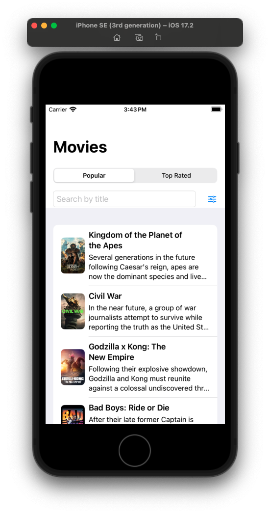
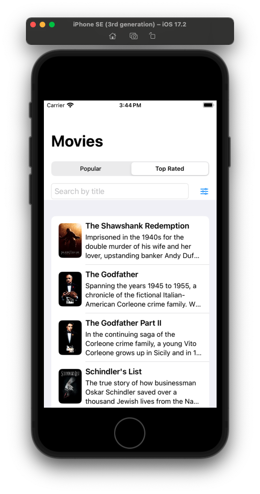
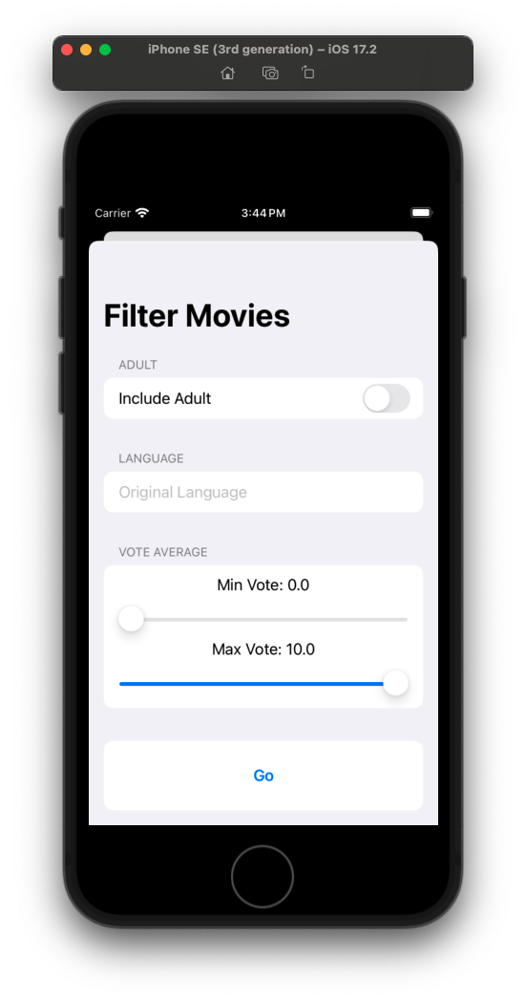
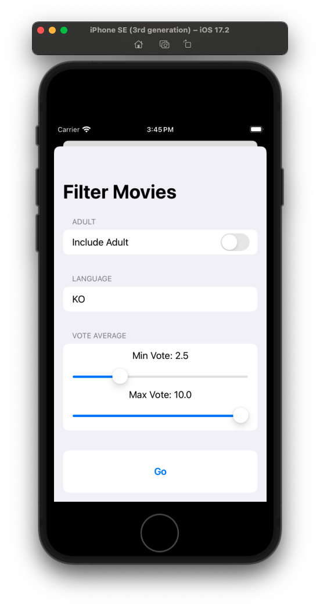
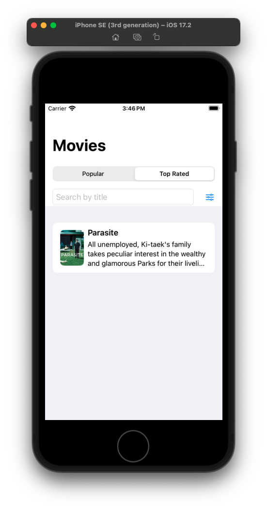
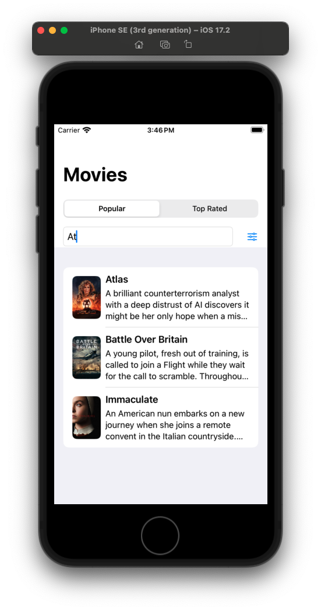
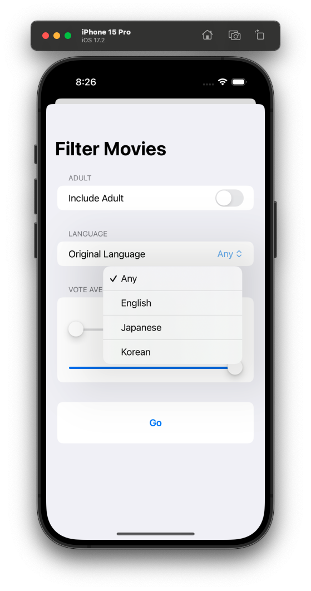

# TopMovies App

TopMovies is an iOS application developed in Swift using SwiftUI. It follows the MVVM (Model-View-ViewModel) design pattern and interacts with The Movie Database (TMDb) API to list, search, and filter movies.


## Features

- **List Movies:** Browse a list of popular movies fetched from TMDb.
- **Search Movies:** Search for movies by title.
- **Filter Movies:** Apply filters to narrow down the list of movies based on various criteria (e.g., genre, release date).


## Technologies Used

- **Swift:** The primary programming language used for iOS development.
- **SwiftUI:** The declarative framework for building user interfaces on iOS.
- **MVVM Design Pattern:** A design pattern that separates the data (Model), UI (View), and business logic (ViewModel) of the application.
- **The Movie Database (TMDb) API:** The API used to fetch movie data.


## Requirements

- iOS 14.0+
- Xcode 12.0+
- An API key from The Movie Database


## Installation

1. Clone the repository:

```bash
git clone git@github.com:mjsanchezc/topmovies.git
cd topmovies
```
    
2. Install dependencies:
```bash
pod install
```

3. Open the project in Xcode.

4. Build and Run:

    - Select your target device or simulator.
    - Click on the run button in Xcode or press Cmd+R.


## Screenshots

Right after finishing with the implementation of the basic list, filter and search features of the app the results for the first version were as follows:

1. The main screen of the app where the movie lists can be seen in a Segment Control element where the user can choose to see the Popular or Top Rated movies, has a search bar and a filter button.




2. The filter view where the user is able to check the Adult rating for the movies, filter by the movie's original language and average rating.



3. The filters in use and the results given:




4. The search function in use and the results obtained:




After testing the basic features for the first verion of the app I determined the next steps to complete the project and improve it further was to implement the unit tests, improve the Language selection filter to be user friendly and improve the UI.

Once implemented the tests and general improvements of the app's functionality the results wew as follows:

1. After improving the Language picker in the Filter view for it to be more user friendly, now it takes the available languages from the presented list and includes them in the Language filter picker:




## License

This project is licensed under the MIT License. See the [LICENSE](https://opensource.org/license/mit) file for more details.


